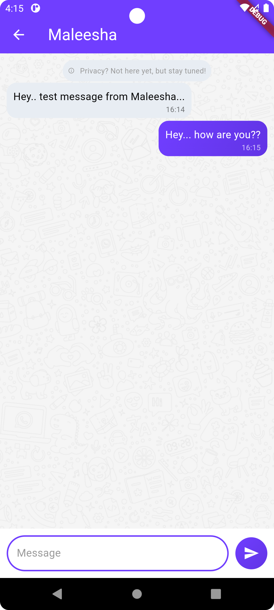

# MessageMate

✨ MessageMate is a simple chat app built with Flutter and Firebase 💬

## 🔥 Features

- **Admin Controls**: 🛠️ Admins can manage app maintenance and updates, ensuring a streamlined user experience during these times.
- **Real-Time Messaging**: ⚡ Instantaneous message delivery powered by Firebase Firestore.
- **User Presence**: 👤 Know who's online and available to chat.

## 🌟 Future Enhancements

- **Message Deletion**: Users will be able to delete messages from both sender and receiver sides.
- **Unsend Messages**: Allow users to unsend messages within a specific time frame.
- **Message Encryption**: Ensure end-to-end encryption for secure communication.
- **UI Enhancements**: Improved user interface for a more intuitive experience.
<br> &nbsp; &nbsp; &nbsp; *Hope I will actually get to do these someday... 🤞*

## 🚀 Getting Started

- Flutter SDK (version 3.0.0 or higher)
- Dart SDK (version 2.19.0 or higher)
- Firebase account with configured Firestore.
- IDE: Visual Studio Code or Android Studio.

### 🔧 Installation

1. Clone the repository:
   ```bash
   git clone https://github.com/dinithmaleesha/flutter-chat-app
   cd MessageMate
   ```

2. Install dependencies:
   ```bash
   flutter pub get
   ```

3. Configure Firebase:
   - Add your `google-services.json` (for Android) and `GoogleService-Info.plist` (for iOS) files to the respective directories.

4. Run the app:
   ```bash
   flutter run
   ```


## 🛠️ Technologies Used

 - **Flutter**: Cross-platform development.
- **Firebase**:
  - Firestore: Real-time database.
- **BloC**: State management.

## 📸 Screenshots

<table>
<tr>
<td></td>
<td></td>
<td></td>
<td></td>
</tr>
<tr>
<td></td>
<td></td>
<td></td>
<td></td>
</tr>
</table>


## 🤝 Contributing

Contributions are welcome! Feel free to open issues or submit pull requests to enhance MessageMate.


